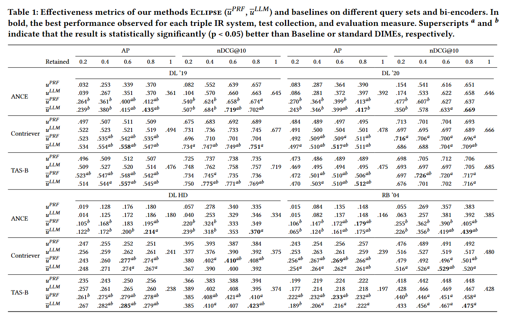

# ECLIPSE-Contrastive-DIME-with-Pseudo-Irrelevance-Feedback

## Overview
This repository contains the implementation and experimental setup for the paper "Eclipse: Contrastive Dimension Importance Estimation with Pseudo-Irrelevance Feedback". The paper introduces Eclipse, a novel method that enhances dense retrieval models by leveraging both relevant and irrelevant documents to improve retrieval performance.

Eclipse is built upon the Manifold Clustering Hypothesis, aiming to reduce noise in high-dimensional embeddings by estimating noisy dimensions from irrelevant documents, effectively filtering them to highlight relevant signals. The method improves upon traditional Dimension Importance Estimators (DIMEs) by incorporating pseudo-irrelevant feedback.

## Benchmarks
Eclipse has been tested on four benchmark datasets: TREC Deep Learning 2019, TREC Deep Learning 2020, DL-HARD 2021, TREC Robust 2004; and three different retrieaval models ANCE, Contriever, TAS-B. 

## Main Result

RQ: Can non-relevant documents be leveraged using irrelevant feedback to improve state-of-the-art DIME approaches?

Table compare both versions of Eclipse with standard
DIMEs (PRF and LLM) and Baseline on the TREC DL ’19, DL ’20, DH, and
RB ’04 datasets, using the ANCE, Contriever, and TAS-B models. We report
the best result among varying the percentage of retained dimensions. Eclipse
exhibits superior performance in the traditional evaluation protocol, improving
performance up to $21.03\%$ (resp. $22.88\%$) in mAP(AP) and $12.04\%$ (resp. $14.18\%$) in nDCG@10 w.r.t. the DIME-based baseline (resp. the baseline using all dimensions). In particular,
both PRF Eclipse and LLM Eclipse show statistically significant improvement
with respect to their DIME counterparts and Baseline. 

